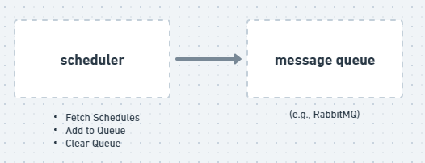

# scheduler-queue-publisher

### Schedule Collection and Management Microservice

- Responsible for: Fetching the current day's schedules from an external API, adding this data to a message queue, and clearing the queue at midnight.

- Technologies: NestJS, @nestjs/schedule for task scheduling, @nestjs/microservices for integration with queues.

